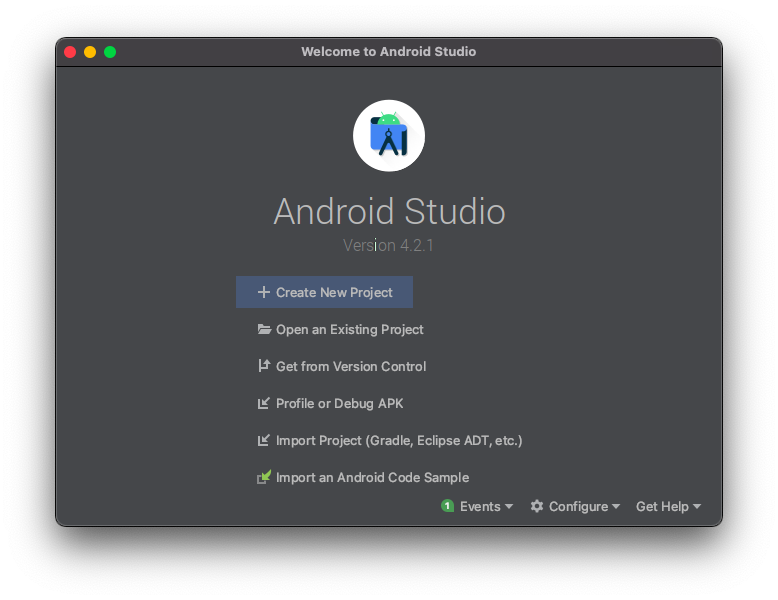
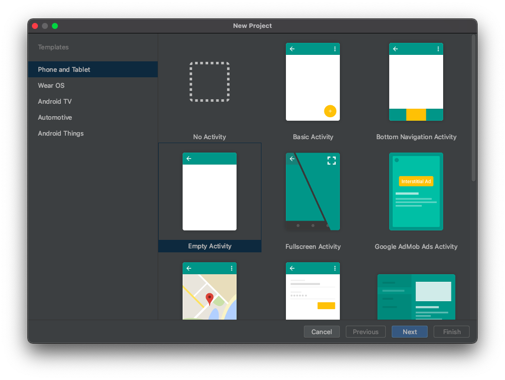
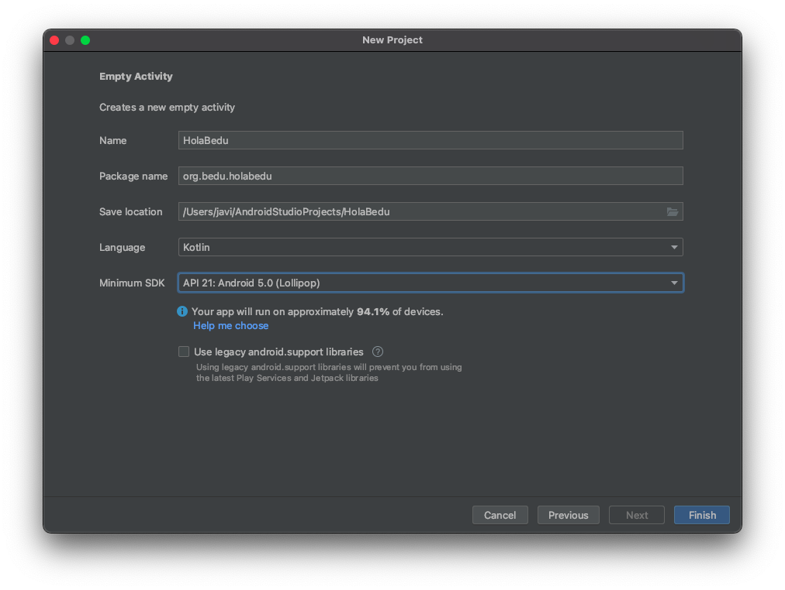

[`Kotlin Intermedio`](../../Readme.md) > [`Sesión 01`](../Readme.md) > `Ejemplo 1`

## Ejemplo 1: Crear un proyecto con Android Studio

### 1. Objetivos :dart:

- Crear un nuevo proyecto android desde cero.
- Conocer la estructura básica de un proyecto android.

### 2. Requisitos :clipboard:

1. Android Studio Instalado en nuestra computadora.

### 3. Desarrollo :computer:

Para que crees un nuevo proyecto de android y podamos identificar su estructura básica seguiremos los siguientes pasos:

1. Abre __Android Studio__

2. La ventana desplegada mostrará distintas opciones. Selecciona la opción de iniciar un nuevo proyecto Android, como se visualiza en la siguiente imagen.

   
   
3. Después se visualizará una ventana de configuración inicial de la orientación del proyecto. En ella se debe elegir un template y un tipo de dispositivo. 

Los tipos son los siguientes.

   - **Phone and Tablet**: para teléfonos móviles y tabletas. Esta es la opción que usaremos.
   - **Wear OS**: dispositivos wearables, como smart watches.
   - **TV**: para hacer aplicaciones de Smart TV.
   - **Automotive**: para vehículos que implementen [Android Auto](https://www.android.com/auto/).
   - **Android Things**: dispositivos IoT (Internet of Things) que implementen [Android Things](https://developer.android.com/things/).
   
Estos tipos de dispositivo se aprecian en las pestañas de la siguiente pantalla. Nosotros seleccionaremos el desarrollo para teléfonos móviles.

   

4. Ahora configuraremos algunos parámetros de nuestra aplicación. 

    - _Name_ es el nombre de nuestro proyecto.

    - El _Package Name_ debe ser único; es por eso que el paquete toma el nombre del dominio web de la organización y lo invierte, dejando al final el nombre de nuestro proyecto en minúsculas. En este caso, el dominio de la organización es [bedu.org](bedu.org) y el nombre del proyecto es holabedu, por lo tanto, el package name es ___org.bedu.holabedu___.

    - _Save location_ contiene la ruta donde se guarda el proyecto.

    - En _Language_ podremos elegir entre __Kotlin__ y __Java__. **En este módulo utilizaremos siempre Kotlin**.

    - El SDK mínimo determina la versión mínima de Android a la que se le brindará soporte.

    - Por último, la opción _Use legacy android.support libraries_ utiliza una biblioteca vieja para dar soporte a versiones android antiguas en el desarrollo con una API más nueva. Su uso no es recomendable en proyectos nuevos, ya que la biblioteca de compatibilidad _AndroidX_ provee de la misma funcionalidad y de muchas herramientas nuevas por medio de Jetpack (conjunto de bibliotecas que agregan nuevas funcionalidades).

    - Luego de llenar estos valores debemos hacer clic en __finish__ para crear el proyecto.

   
   
  
**¡Felicidades! Creaste tu primer proyecto con Android Studio**

[`Anterior`](../Readme.md#setup-inicial) | [`Siguiente`](../Ejemplo-02/Readme.md)

