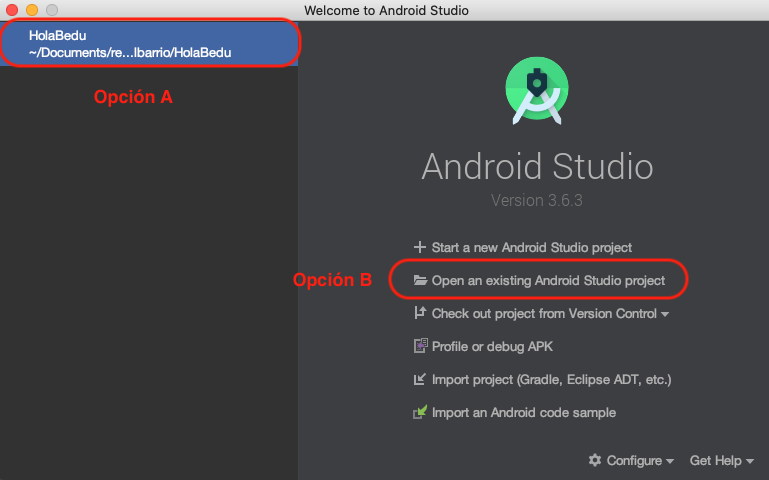
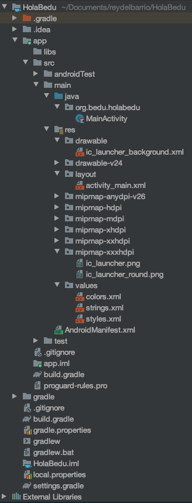
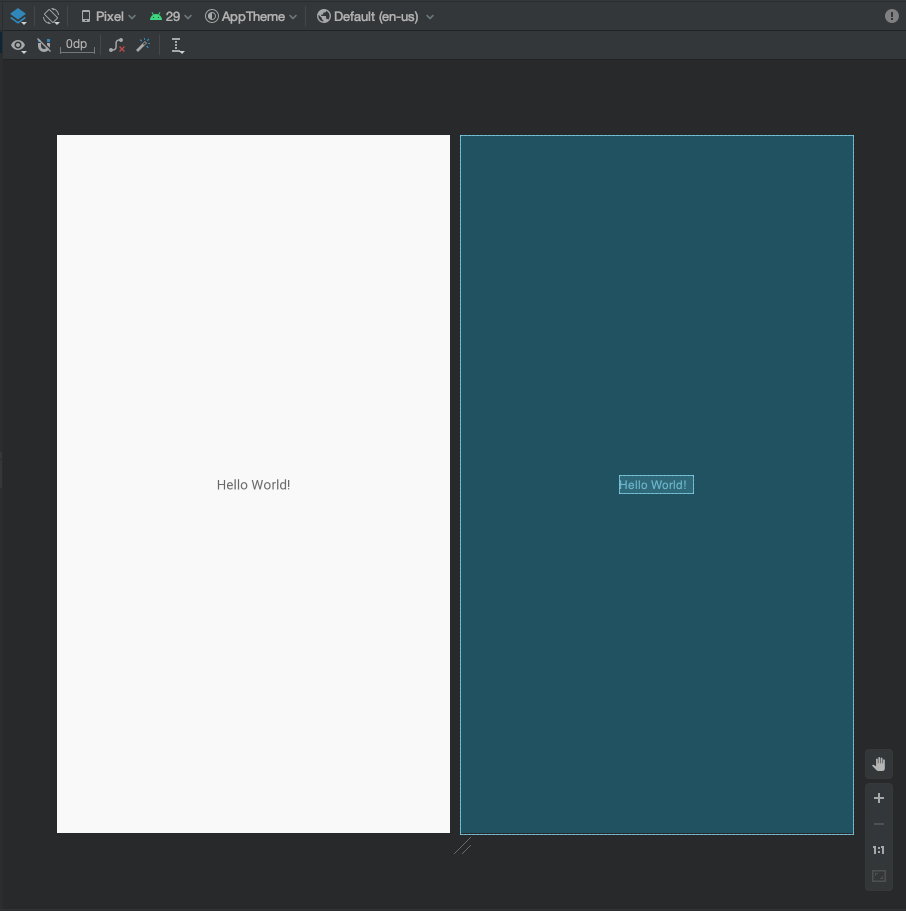
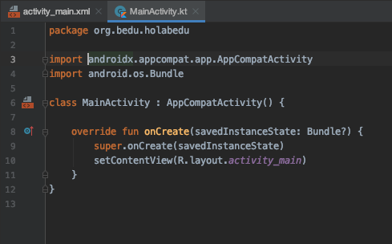

[`Kotlin Intermedio`](../../Readme.md) > [`Sesión 01`](../Readme.md) > `Ejemplo 2`

## Ejemplo 2: Estructura del proyecto

### 1. Objetivos :dart:

- Analizar la estructura de un proyecto en blanco.
- Correr el proceso de _Make Project_

### 2. Requisitos :clipboard:

1. Android Studio instalado en nuestra computadora.

### 3. Desarrollo :computer:

1. Abre __Android Studio__

2. Es necesario abrir el proyecto del [Ejemplo 1](../Ejemplo-01).  Android Studio desplegará la siguiente ventana. En ella hay dos opciones para abrirlo: 
	- **Opción A**. Es un __shortcut__ (atajo) para abrir un proyecto abierto recientemente. Basta con dar click a la sección.
	- **Opción B**. Permite abrir nuestro proyecto seleccionando la ruta.

   
   
3. Al abrirse la IDE, visualizaremos una estructura de directorios que conforman nuestro proyecto. 

A continuación explicamos cada directorio:

- **manifest**: contiene el archivo AndroidManifest.xml.
- **java**: contiene los archivos Java, o en este caso Kotlin, de código fuente separados por nombres de paquetes, incluido el código de prueba JUnit.
- **res**: contiene todos los recursos del proyecto, como archivos XML que almacenan colores, strings, y elementos gráficos, como imágenes de mapa de bits, todos divididos en subdirectorios pertinentes.
	- **drawable**: archivos de mapas de bits (.png, .9.png, .jpg y .gif) o archivos XML.
	- **layout**: aquí se almacenan los archivos XML de nuestra Interfaz de Usuario, donde se declaran las Vistas a utilizar, sin definir funcionalidad alguna.
	- **mipmap**: archivos de elementos de diseño para diferentes densidades de los íconos de selectores.
	- **values**: archivos XML que contienen valores simples, como strings, valores enteros y colores.
	

   

> **Nota** 💡  
> los elementos de la raíz __Gradle Scripts__ forman parte de nuestro proyecto, pero los analizaremos más adelante con detalle.
 
La estructura anterior es una representación simplificada del proyecto y no muestra la estructura de directorios y archivos en nuestro proyecto; por lo tanto, si queremos visualizarla como realmente es, deben seguirse las siguientes indicaciones. 

En la ventana __Project__ es posible observar un selector que tiene elegida la opción android por defecto. Haz clic en él y selecciona __Project__.

   
   
Esta versión contiene la organización real del proyecto. Algunas cosas a notar son las carpetas repetidas en res, tales como __drawable__ o __mipmap__. 

Tomando como ejemplo el anterior, se puede ver una nomenclatura como __hdpi__ o __mdpi__. Se organiza así para definir imágenes con distintas densidades y para que el sistema asigne el recurso de acuerdo a la resolución de la pantalla del dispositivo android. Definen que tan expandible es una imagen usando la siguiente métrica:

|         | Tamaño de la pantalla   |
|---------|-------------------------|
|    LDPI |          0.75x          |
|    MDPI |  1.0x (tamaño original) |
|    HDPI |           1.5x          |
|   XHDPI |           2.0x          |
|  XXHDPI |           3.0x          |
| XXXHDPI |           4.0x          |

Existen nomenclaturas para otros tipos de clasificación, como el idioma o versión.

   
   
En general, la opciones de visualización del proyecto adecuado dependerá del objetivo que tengas en el momento al abrir la IDE.

#### MainActivity.kt y activity_main.xml

Para continuar con los objetivos de la actividad debe aclararse que al crear el proyecto los archivos **MainActivity.kt** y **activity_main.xml** estaban abiertos. 

Si se hace clic en __activity_main.xml__ se visualizará lo que parece ser una pantalla de una aplicación y su __Blueprint__. Además, en el archivo __MainActivity.kt__ se encontrará código, en lenguaje Kotlin, definiendo un Activity y definiendo un callback __onCreate__ que setea el contenido del archivo XML. 

Con base en lo anterior se puede describir lo siguiente.

- __activity_main.xml__ es un layout y contiene la descripción de la interfaz gráfica del menú principal.

   
   
- __MainActivity.kt__ contiene una clase que hereda de __AppCompactActivity__, por lo que es una Activity que contiene el código fuente para hacer funcionar el menú principal.

   

[`Anterior`](../Ejemplo-01/Readme.md) | [`Siguiente`](../Ejemplo-03/Readme.md)

