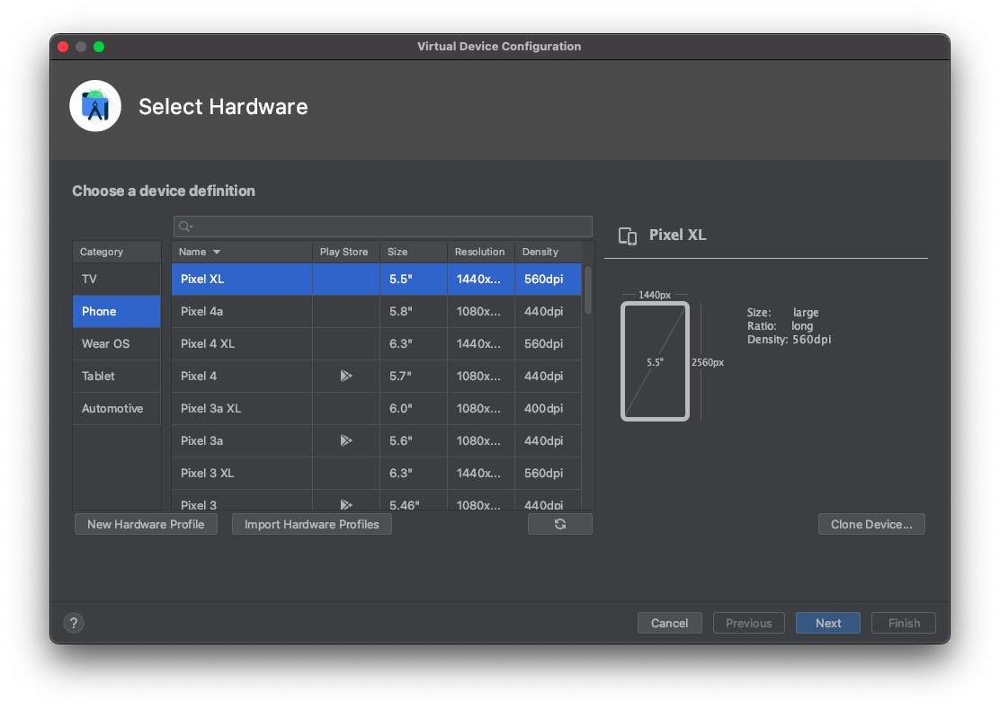
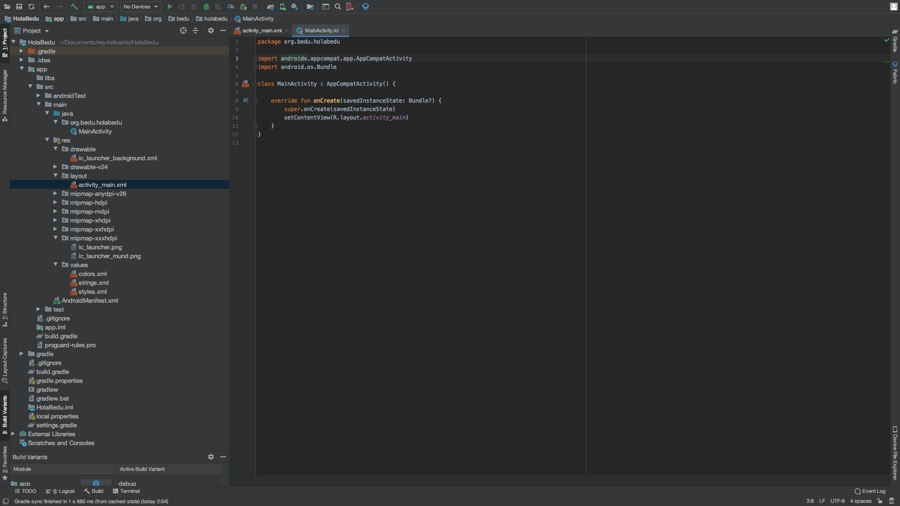
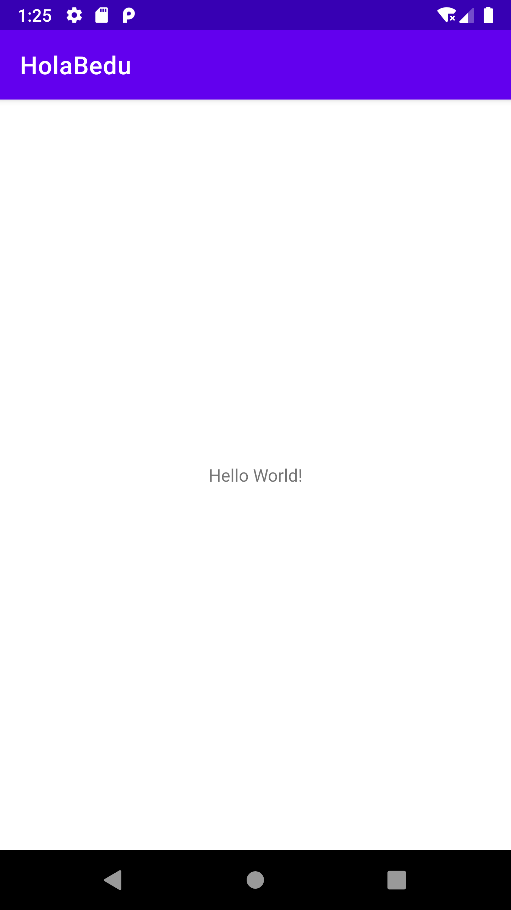

[`Kotlin Intermedio`](../../Readme.md) > [`Sesión 01`](../Readme.md) > `Ejemplo 3`

## Ejemplo 3: Emulación de dispositivos

### 1. Objetivos :dart:

- Crear un dispositivo virtual Android.
- Ejecutar un proyecto Android mediante un emulador configurado.

### 2. Requisitos :clipboard:

1. Android Studio instalado en nuestra computadora.

### 3. Desarrollo :computer:

Para probar cualquier aplicación en desarrollo se requiere un dispositivo Android a la mano, pero este no tiene que ser físico forzosamente, pues Android Studio puede crear emuladores de teléfonos reales y personalizados a través del __Android Virtual Device (AVD) MANAGER.__ Ahora aprenderemos a crear un AVD, o Dispositivo Virtual Android.

Para hacerlo realiza los siguientes pasos:

1. Inicia Android Studio y abre el proyecto creado previamente.
2. Localiza un ícono de un celular con la cabeza de la mascota de android en la barra de herramientas. Este botón brinda acceso al __AVD MANAGER__, donde crearemos nuestro dispositivo virtual, así que haz clic sobre él.

3. Al desplegarse la ventana, si no tenemos dispositivos creados anteriormente aparecerá un botón con la leyenda __Create virtual device__. Haz clic sobre él.

4. Explora un poco las opciones. Hay distintos teléfonos con configuraciones diferentes de pantalla, algunos con la Play Store disponible. Después selecciona uno y haz clic en siguiente.

5. Se instalará Android Pie en nuestro dispositivo. Para ello haz clic en __Download__, al lado del nombre de la versión seleccionada.

6. Acepta los términos y condiciones, y espera a que la descarga termine. Cuando esto suceda haz clic en finalizar.

7. De regreso en la selección de __Imagen de Sistema__, selecciona __Android Pie__ y haz clic en Next.

8. En este último paso deja las configuraciones finales intactas (orientación inicial del dispositivo, etcétera) y concluye el proceso.

¡Listo! El dispositivo está configurado. Es posible hacer más configuraciones de dispositivos virtuales si se requiere.

¡Es momento de ejecutar la aplicación! 
La manera más práctica de hacerlo es hacer clic en el botón verde de Play ▶️, como se ve en la imagen.

Espera un momento y estará hecho. La aplicación debe correr en nuestro emulador, como se aprecia a continuación.

  
**¡Felicidades! Ahora estás listo para correr tu aplicación en un dispositivo real**

[`Anterior`](../Ejemplo-02/Readme.md) | [`Siguiente`](../Reto-01/Readme.md)

