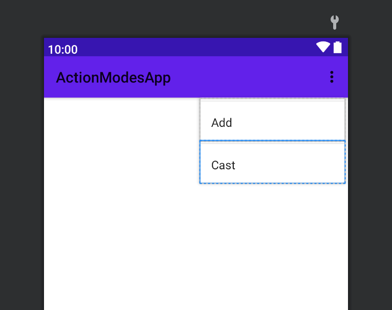

[`Kotlin Intermedio`](../../Readme.md) > [`Sesión 07`](../Readme.md) > `Ejemplo 3`


## Ejemplo 3: Action Modes

<div style="text-align: justify;">

### 1. Objetivos :dart:

- Implementar Contextual menus reutilizables para Views y Activities.

### 2. Requisitos :clipboard:

1. Android Studio 4.1
2. Kotlin 1.3
3. AVD Virtual device con Android API 23 o superior

### 3. Desarrollo :computer:

## ActionMode

Recordando los menús contextuales, estos son los enfocados sobre elementos de UI que especifiquemos, y así encontramos los `ActionMode`, una implementacion similar al contextual menu. Revisaremos más, así que veamos a qué nos referimos.


Como se muestra en la imagen, tenemos dos tipos.
Primaria y Flotante.

En la Primaria, los elementos se muestran en el action bar. En el caso de Flotating, el toolbar es mostrado sobre la vista de manera flotante. Es importante mencionar que solo se podrá ocultar este menú de manera programada.

Esto nos da dos Properties:

- `ActionMode.TYPE_PRIMARY`
- `ActionMode.TYPE_FLOATING`

Los action mode pueden ser mostrados sobre cualquier `View` o `Activity`.

<!-- En cualquier caso, hay dos funciones que debemos usar.

- `fun startActionMode(callback: ActionMode.Callback): ActionMode`
 
- `fun startActionMode(callback: ActionMode.Callback, type: Int): ActionMode`

Vemos el parámetro `ActionMode.Callback`, este hace referencia a un _lifecycle_ donde podemos hacer un _override_ de cualquiera de sus funciones en un `Activity`, ya sea:

- `onActionModeStarted`
- `onActionModeFinished`

Todo esto con el fin de manipular el ciclo de vida. -->


El `ActionMode` depende de una clase que actúa como **callback** en donde tenemos que implementar estas cuatro funciones.

- `onCreateActionMode`
- `onPrepareActionMode`
- `onDestroyActionMode`
- `onActionItemClicked`


## Flotating ActionMode 

Cuando tenemos nuestro ActionMode flotante, tenemos cambien un _callback_ nuevo, llamado `Callback2`. Este agrega solo una función más, esta es:

- `onGetContentRect`

La cual te dará la posición en la pantalla para el elemento flotante.


## Veamos como implementarlo


Como ya hemos visto, crearemos un directorio para ___Menu___ y un archivo ___menu.xml___.
En el ___Activity Main xml___ agregaremos un elemento de UI como un `TextView`.
Igualmente, agregaremos dos íconos de tu elección a la carpeta ___Drawable___.




```xml
<?xml version="1.0" encoding="utf-8"?>
<menu xmlns:android="http://schemas.android.com/apk/res/android">
     <item
        android:id="@+id/option_1"
        android:icon="@drawable/ic_add"
        android:title="Add" />
    <item
        android:id="@+id/option_2"
        android:icon="@drawable/ic_cast"
        android:title="Cast" />
</menu>
```

Nos dirigimos a nuestro `MainActivity`, declaramos el elemento de UI, en este caso `TextView`. Este recibirá la acción de `onClick`.

```kotlin
 var textView: TextView = findViewById(R.id.txTextView)
```

Sobre este textView agregaremos una acción `setOnClickListener()`.

```kotlin
    textView.setOnLongClickListener {
        if (actionMode == null) actionMode = startSupportActionMode(ActionModeCallback())
        true
    }
```

Para ejecutar el `Action Mode` es necesario implementar un `ActionMode.Callback`.
Declaramos una variable global para `ActionModes`.

```kotlin
 private var actionMode: ActionMode? = null
```

Dentro de la misma clase de `Main Activity` creamos un `Callback` con los métodos para poder ejecutar el `ActionMode` como una clase interna.

```kotlin
        inner class ActionModeCallback: ActionMode.Callback {
            ...
        }
```

como vimos se tienen que implementar cuatro métodos:

- `onCreateActionMode` en donde se infla el `ActionMode`

```kotlin
        override fun onCreateActionMode(mode: ActionMode?, menu: Menu?): Boolean {
            val inflater = mode?.getMenuInflater()
            inflater?.inflate(R.menu.menu, menu)
            mode?.setTitle("Options Menu")
            return true
        }
```

- `onPrepareActionMode` se llama cuando se tienen que recargar una acción en el menu.

```kotlin
    override fun onPrepareActionMode(mode: ActionMode?, menu: Menu?): Boolean {
        return true
    }
```

- `onDestroyActionMode` destruye el `ActionMode`

```kotlin
    override fun onDestroyActionMode(mode: ActionMode?) {
        actionMode = null
    }
```

- `onActionItemClicked` define el evento de darle click a alguno de los items

```kotlin
    override fun onActionItemClicked(mode: ActionMode?, item: MenuItem?): Boolean {
        when (item?.getItemId()) {
            R.id.option_1 -> {
                actionMode?.setTitle("Option1")
                return true
            }
        }
        return false
    }
```

Ejecutamos el código y el resultado debe ser similar a este:


[`Anterior`](../Reto-02/Readme.md) | [`Siguiente`](../Readme.md)


</div>
